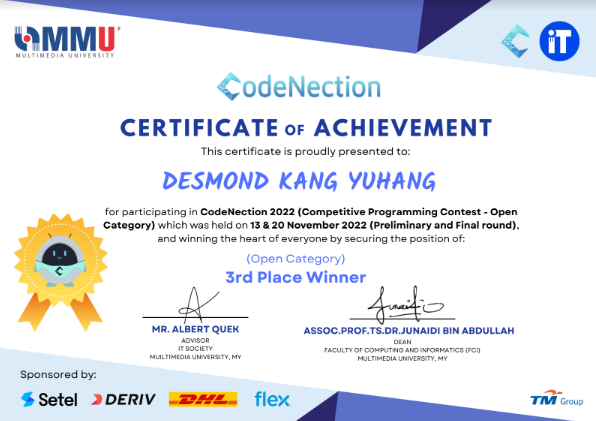
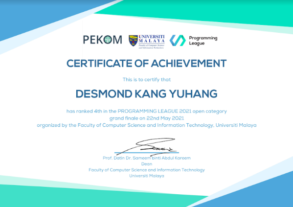

# Achievement and Awards

<!--more-->

***

## **Cisco Asia-Pacific, Japan and China NetAcad Riders Competition**
:trophy: Champion (Malaysia)  
:school: Cisco Network Academy  
:date: April 2022  

        
***

## **Huawei ICT Competition**
:trophy: Champion (Malaysia)  
:school: Huawei ICT Academy  
:date: November 2022  

TODO: Add Certificate Photo

***

## **CodeNection Competitive Programming Competition**
:trophy: 2nd Runner Up (Open Category)  
:school: Multimedia University  
:date: November 2022  

***

## **Programming League National 2021**
:trophy: 4th Place (Open Category)  
:school: Faculty of Computer Science & Information Technology  
:classical_building: University of Malaya
:date: May 2021  

