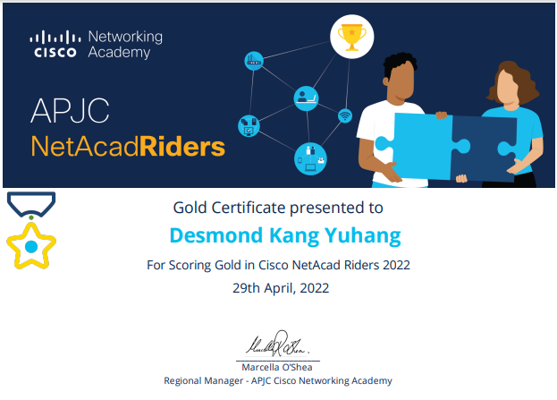

# Achievement and Awards

<!--more-->

***

## **Huawei ICT Competition - Global**
:trophy: Second Prize (Global)  
:school: Huawei ICT Academy  
:date: 28 May 2022  
:earth_asia: ShenZhen, China  

***

## **Huawei ICT Competition - Asia Pacific**
:trophy: Champion (Asia Pacific)  
:school: Huawei ICT Academy  
:date: 17 March 2022  
:earth_asia: Jakarta, Indonesia  

***

## **Cisco Asia-Pacific, Japan and China NetAcad Riders Competition**
:trophy: Champion (Malaysia)  
:school: Cisco Network Academy  
:date: April 2022  

        
***

## **Huawei ICT Competition - National**
:trophy: Champion (Malaysia)  
:school: Huawei ICT Academy  
:date: November 2022  
:earth_asia: Kuala Lumpur, Malaysia  

***

## **CodeNection Competitive Programming Competition**
:trophy: 2nd Runner Up (Open Category)  
:school: Multimedia University  
:date: November 2022  

***

## **Programming League National 2021**
:trophy: 4th Place (Open Category)  
:school: Faculty of Computer Science & Information Technology  
:classical_building: University of Malaya  
:date: May 2021  

