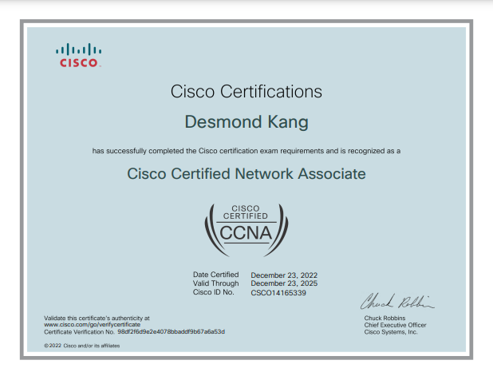
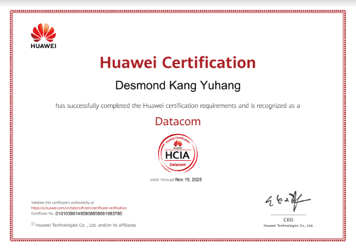

# Professional Certifications

<!--more-->

***

## **Cisco Certified Network Associate (CCNA, 200-301)**
:school: Cisco Network Academy  
:date: December 2022 - December 2025  
:mortar_board: TCP/IP, Switching & Routing, Enterprise Network Design  

        
***

## **Huawei Certified ICT Professional (HCIP)**
:school: Huawei ICT Academy  
:date: December 2022 - December 2025  
:mortar_board: Data Communication, Network Automation, ICT Core Technology  

***

## **Huawei Certified ICT Associate (HCIA)**
:school: Huawei ICT Academy  
:date: November 2022 - November 2025  
:mortar_board: Network Basics, Network Access, WAN, WLAN  

