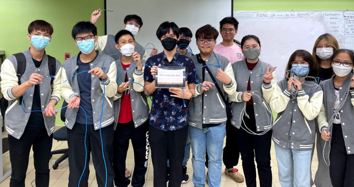
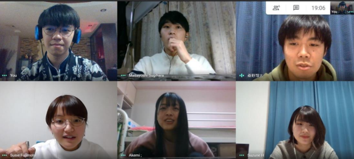

# Volunteerism

<!--more-->

***

## **CCNA Lab Demo**
:school: Faculty of Computer Science & Information Technology, UM  
:date: October 2022 - December 2022  

We guide our Networking juniors to excel in their academic study.  
We showcase practical configuration techniques on cisco devices and theoretical computer networks explanation to our juniors.

***

## **Japanese Language Club Teaching Assistant**
:school: International Student Centre, University of Malaya  
:date: September 2020 - December 2020   

This was a co-curicular activity that welcome students from Univerisity of Malaya to participate. In this club, we provide foreign language classes to the students up to intermediate level.
